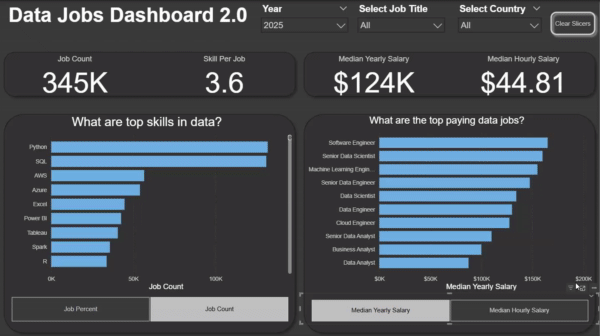

# Data Jobs Dashboard 2.0 w/ Power BI

</a>

## Introduction

Navigating the data job market can feel like a maze with information scattered everywhere. This dashboard (V2.0) is designed specifically for **Job Seekers, Job Transitioners, and Job Swappers** like myself to cut through the clutter! Using a real-world dataset of over **2 million** data science job  postings from 2023-2025—rich with details on titles, salaries, and locations—this project offers a streamlined, single-page interface to quickly explore crucial market trends and compensation insights.

### Dashboard File
You can find the file for the dashboard here: [`Data_Jobs_Dashboard_2.0.pbix`](https://drive.google.com/file/d/1h3bV6Z2lHiBigWDj4NTE9hq1cpsUj8sI/view?usp=sharing).  
While the file in this GIT is just for 2024 data (the 2023-2025 data is too large for GIT: [`Data_Jobs_Dashboard_2.0(2024).pbix`](Jobs_Dashboard_Project_2.pbix)
## Skills Showcased

This project put key Power BI features into practice. Here's what we mastered:

* **Dashboard Design:** Crafting an intuitive and visually appealing report layout.
* **Power Query ETL:** Performing data cleaning, shaping, and transformation.
* **Data Modeling:** Building efficient data models with relationships (Star Schema principles).
* **DAX Fundamentals:** Creating calculations, measures, and aggregations to derive key insights.
* **Visualizations Utilized:**
    * **Core Charts:** Column, Bar, Line, and Area charts for comparisons and trends.
    * **Cards:** To highlight key performance indicators.
    * **Tables:** For presenting detailed, tabular information.
    * **Chart Variety:** Selecting from common and uncommon chart types for effective storytelling. 
* **Interactive Features:**
    * **Slicers:** Enabling dynamic, user-driven data filtering.
    * **Parameters:** Adding more in-depth analysis by connecting more currated slicers to specific visualizations
    * **Buttons** For streamlined navigation and managing/resetting report views.
---
## Dashboard Overview (Version 2.0 - Single Page Focus)

This second iteration consolidates the dashboard into a **single, focused page**, designed to give job seekers the most critical market insights at their fingertips.

 

This page acts as your concise mission control for the data job market. It showcases key performance indicators (KPIs) like **Job Count, Skills Per Job, Median Yearly Salary, and Median Hourly Salary**. You can also quickly see **Skill Popularity** (by job percent or count) and compare **Salaries across different Job Titles, Countries, and Years**, all designed for an efficient overview.

---

## Conclusion

This updated dashboard (Version 2.0) showcases Power BI's ability to transform extensive job posting data into a powerful, streamlined tool for career analysis. It empowers **Job Seekers, Job Transitioners, and Job Swappers** by allowing them to filter and explore essential market insights efficiently on a single page, helping them make informed decisions about their next career move.
