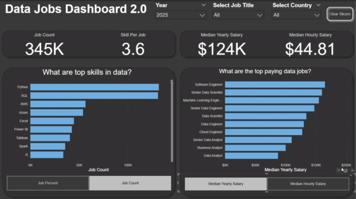

# Data Job Analysis w Power BI Portfolio

Repository of my data job dashboards built with Power BI. From foundational reports to more advanced interactive analysis all aimed at turning data into clear actionable insights. 

# Featured Dashboards
Explore my two dashboards below. Each with its own README with more indepth detail and specifics.

## Data Jobs Dashboard v1 (Comprehensive Exploration)

  
</a>

**Key Power BI Skills Utilized:**

* Dashboard Layout & Design
* Power Query (ETL & Data Shaping)
* Basic Data Modeling (Table Relationships)
* Implicit Measures & Standard Aggregations
* Core Charts (Bar, Line, Area, Column)
* Map Visualizations for Geospatial Data
* KPI Cards & Detailed Data Tables
* Interactive Slicers for Filtering
* Buttons & Bookmarks for Page Navigation
* Drill-Through Functionality
  
[**View Full Project 1 Details HERE**](Project_1/README.md)

## Data Jobs Dashboard v2 (Version 2.0 - Single Page Focus)

 
</a>

**Key Power BI Skills Utilized:**

* Advanced Dashboard Design (Single-Page UX & Optimization)
* Complex Power Query Transformations
* Star Schema Data Modeling Principles
* Explicit DAX Measures (e.g., `CALCULATE`, context modifiers)
* Dynamic Visualizations (driven by Parameters/Slicers)
* Field & Numeric Parameter Implementation for "What-If" Analysis
* Advanced Card Visualizations
* Optimized Slicers & Advanced Cross-Filtering Techniques
* Report Performance Considerations

[**View Full Project 2 Details HERE**](Project_2/README.md)

## About This Portfolio

Each dashboard linked above has its own detailed `README.md` file within its respective project folder. These offer deeper insights into the project objectives, data sources, specific Power BI techniques employed, and a closer look at the dashboard build.
